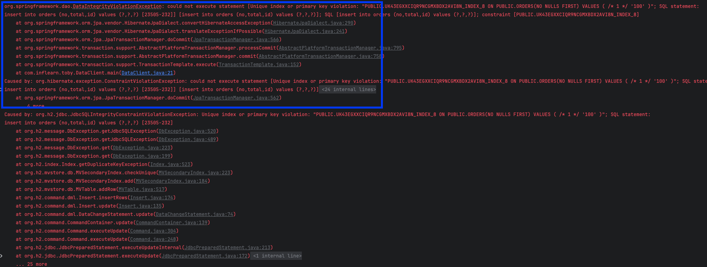
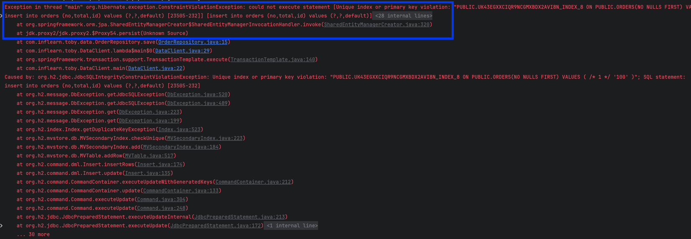

# [6. 예외 - DataAccessException과 예외 추상화]

---

## 에러 발생 코드

```java
@Entity
@Table(name = "orders")
public class Order {
    @Id
    @GeneratedValue(strategy = GenerationType.IDENTITY) // strategy를 IDENTITY로 설정
    private Long id;
    
    ...
}

public class OrderRepository {

    @PersistenceContext
    private EntityManager entityManager;

    public void save(Order order) {
        entityManager.persist(order);
    }
}

public class DataClient {
    public static void main(String[] args) {
        BeanFactory beanFactory = new AnnotationConfigApplicationContext(DataConfig.class);
        OrderRepository orderRepository = beanFactory.getBean(OrderRepository.class);
        JpaTransactionManager transactionManager = beanFactory.getBean(JpaTransactionManager.class);

        try {
            new TransactionTemplate(transactionManager).execute(status -> {
                Order order = Order.create("100", BigDecimal.TEN);
                orderRepository.save(order);

                System.out.println("Order saved: " + order);

                Order order2 = Order.create("100", BigDecimal.ONE);
                /*
                여기서 에러 발생이지만 DataIntegrityViolationException이 발생하지 않고 
                org.hibernate.exception.ConstraintViolationException 에러 발생        
                 */
                orderRepository.save(order2);
                return null;
            });
        } catch (DataIntegrityViolationException e) {
            System.out.println("주문번호 중복 복구 작업");
        }
    }
}
```

---

## 에러 발생 원인

먼저 `DataIntegrityViolationException`가 아닌 `org.hibernate.exception.ConstraintViolationException`이 발생하는 이유에 대해 알아야 합니다.

`DataIntegrityViolationException`는 `PersistenceExceptionTranslationPostProcessor`가 발생시키는 예외로 내부에서 에러가 발생할 경우 `DataIntegrityViolationException` 예외로 전환해주는 역할을 담당합니다.

```
PersistenceExceptionTranslationPostProcessor가 전환해주는 예외 종류

- org.hibernate.exception.ConstraintViolationException
- org.hibernate.PropertyValueException
- org.hibernate.exception.DataException
`
```

```
`org.hibernate.exception.ConstraintViolationException`가 발생하는 경우
데이터베이스 무결성 제약 조건을 위반했을 때 발생하게 됩니다.

- @NotNull, @Size, @Email, @Pattern 등의 제약 조건을 위반했을 때
- @Column(unique = true)로 설정한 필드에 중복된 값을 저장하려고 할 때
- @Column(nullable = false)로 설정한 필드에 null 값을 저장하려고 할 때
```

***그렇기 때문에 JPA의 `TransactionManager` 내부에서 `org.hibernate.exception.ConstraintViolationException`가 발생하게 되면 `DataIntegrityViolationException`으로 전환되어 발생하게 됩니다.***

이제 에러가 발생한 원인을 살펴보게 되면 `@GeneratedValue`의 strategy를 `GenerationType.AUTO`로 설정할 경우 `SEQUENCE` 또는 `TABLE` 전략을 사용하게 되는데 
`SEQUENCE` 또는 `TABLE` 전략은 `IDENTITY` 전략과 동작 방식에 차이가 있어 발생한 문제였습니다.

그렇기 때문에 먼저 `IDENTITY` 전략의 동작 방식에 대해 이해할 필요가 있습니다.

### IDENTITY 전략의 동작 방식
- IDENTITY 전략의 경우 DB의 ID 자동 생성 방식을 사용하는 전략입니다.
- 따라서 ID 생성을 DB가 담당한다고 설명할 수 있고, DB가 담당하기 때문에 실제 INSERT가 되기 전까지는 entity의 ID 값을 알 방법이 없습니다.
- 그렇기 때문에 IDENTITY 전략을 사용할 경우 EntityManager.persist()를 호출할 때 영속화를 위해 해당 시점에 DB에 INSERT 쿼리를 실행하게 됩니다.
- INSERT 쿼리를 실행하게 위해 내부적으로 EntityManager.flush() 를 호출하는데 flush()를 내부적으로 호출하기 때문에 TransactionManager 내부에서 호출하는 것이 아니게 됩니다.

### 결론
`TransactionManager`는 commit 시점에 자동으로 flush()를 호출하는데 이 때 예외가 발생하게 되면 `TransactionManager` 내부에서 발생한 것이기 때문에
`PersistenceExceptionTranslationPostProcessor`에 의해 `DataIntegrityViolationException`으로 예외가 전환되어 발생하게 됩니다.

하지만 `IDENTITY` 전략을 사용할 경우 `EntityManager.persist()` 시점에 `EntityManager.flush()`를 호출하기 때문에 `TransactionManager` 내부에서 호출하는 것이 아니게 됩니다.

따라서 동일하게 `org.hibernate.exception.ConstraintViolationException` 예외가 발생하게 되어도 `DataIntegrityViolationException`으로 전환되지 않고 그대로 예외가 발생하게 됩니다.


### @GeneratedValue(strategy = GenerationType.IDENTITY) 사용 시 stacktrace


### @GeneratedValue(strategy = GenerationType.AUTO) 사용 시 stacktrace

